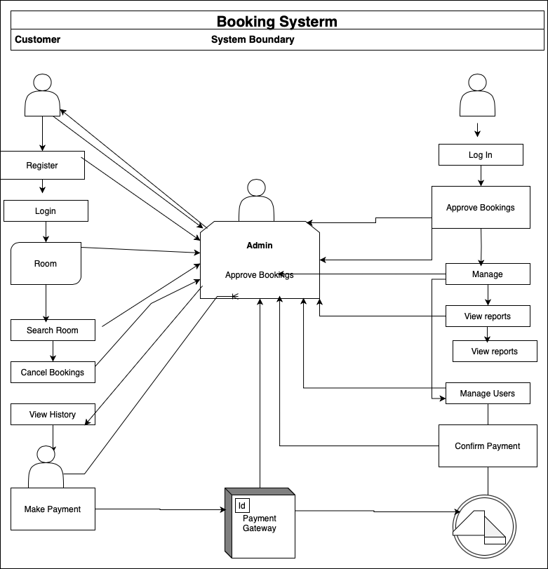

### title

Requirement Analysis in Software Development

### What is Requirement Analysis?

Requirement Analysis is the systematic process of identifying, documenting, and managing the needs and expectations of stakeholders for a software system. It involves gathering, analyzing, and defining what the software should do, how it should behave, and what constraints it must operate within. Requirement analysis is not just a phase in the SDLC - it's the cornerstone that determines the success or failure of a software project. Investing time and resources in thorough requirement analysis pays dividends throughout the entire development lifecycle by reducing risks, improving quality, and ensuring stakeholder satisfaction.

### Importance in the Software Development Lifecycle (SDLC)

1. User interface design is based on user requirements
2. Developers use requirements to understand what to build
3. Requirements form the basis for test case creation
4. Scope Creep: Well-defined requirements prevent uncontrolled expansion
5. Miscommunication: Clear documentation reduces misunderstandings

### Why is Requirement Analysis Important?

1. Foundation for All Development Activities
   Requirement Analysis serves as the fundamental blueprint that guides every subsequent phase of the SDLC. Just as a building requires architectural plans before construction begins, software development requires clear requirements before any code is written.

2 Risk Mitigation and Cost Control
Proper Requirement Analysis acts as a powerful risk management tool, preventing the most costly and common causes of software project failure while dramatically reducing overall project costs.

3.  Stakeholder Alignment and Quality Assurance
    Requirement Analysis ensures all stakeholders share a common vision of the final product while establishing measurable quality criteria that guide development decisions.

### Key Activities in Requirement Analysis.

1. Requirement Gathering

- Engage with stakeholders to collect initial requirements.
- Use various techniques like interviews, surveys, and workshops.

2. Requirement Elicitation

- Refine and elaborate on the gathered requirements.
- Use techniques like brainstorming, focus groups, and prototyping.

3. Requirement Documentation

- Document the requirements in a detailed and structured format.
- Use requirement specification documents, user stories, and use cases.

4. Requirement Analysis and Modeling

- Analyze and prioritize the requirements.
- Create models to visualize and understand the requirements.

5. Requirement Validation

- Review and validate the requirements with stakeholders.
- Define acceptance criteria and ensure traceability.

### Types of Requirements

1. Functional Requirements (What the system does)
   Functional Requirements define what the system should do - they specify the specific behaviors, functions, and features that the software must provide to meet user needs and business objectives. These requirements describe the system's functionality in terms of inputs, processing, and expected outputs.

- Hotel Management: Managers updating hotel info, managing inventory, viewing bookings
  Customer Service: Searching hotels, making bookings, processing payments
  View Booking Service: Displaying current and historical booking data

2. Non-functional Requirements
   Non-functional Requirements define how the system should perform - they specify the quality attributes, performance criteria, and constraints under which the system must operate. These requirements don't describe what the system does, but rather how well it does it.

- Performance: Load balancing, CDN delivery, Redis caching for fast response times

### Use Case Diagrams

### Benefits of Use Case Diagrams:

- Clear visualization of system behavior
- Easy communication between non-technical stakeholders and developers
- Helps identify required features early
- Defines system boundaries and responsibilities

## 🖼️ Use Case Diagram

Here is the use case diagram for the Booking System:

### Acceptance Criteria.

Importance of Acceptance Criteria in Requirement Analysis

Acceptance criteria are a vital part of requirement analysis. They define the conditions that a software feature must meet in order to be accepted by stakeholders. These criteria act as a clear checklist for both developers and testers to determine when a user story or functionality is complete and working as expected.

- Why Acceptance Criteria Matter

* Clarity: They remove ambiguity and ensure everyone understands what the feature should do.
* Scope Control: They help avoid scope creep by strictly outlining what’s included.
* Testability: They make it easier to write test cases for quality assurance.
* User-Focused: They ensure the delivered feature meets the actual user needs.

### Examples

- The system must calculate and display applicable taxes and total cost.
- The user must select a payment method (e.g., credit card, mobile money).
  - The checkout process must include a confirmation step before final submission.
  - Upon successful checkout, the user should receive a booking confirmation with a unique reference number.
  - If payment fails, an appropriate error message should be displayed, and the user must be prompted to retry.
